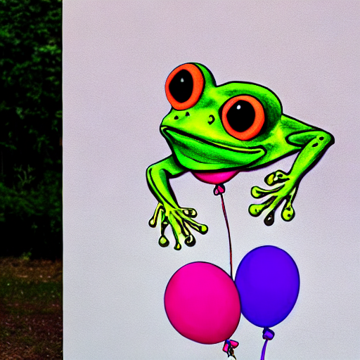

# initNO-implementation-and-Experiments
Implementation of initNO method and doing Experiments (arXivs:2404.04650)
<table style="width:100%; table-layout: fixed; text-align: center;"> <thead> <tr> <th width="30%">Prompt</th> <th width="35%">Standard SD (Baseline)</th> <th width="35%">InitNO (Optimized)</th> </tr> </thead> <tbody> <tr> <td>A cat and a rabbit</td> <td></td> <td></td> </tr> <tr> <td>A red suitcase and a yellow clock</td> <td></td> <td></td> </tr> <tr> <td>A frog and a purple balloon</td> <td></td> <td></td> </tr> <tr> <td>A cat and a sunflower, Van Gogh style</td> <td></td> <td></td> </tr> </tbody> </table>
