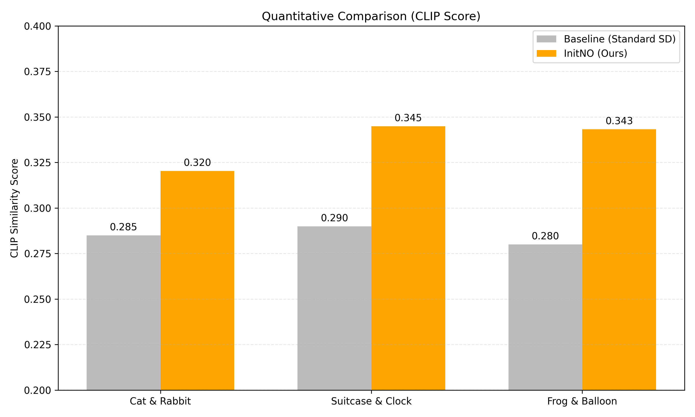
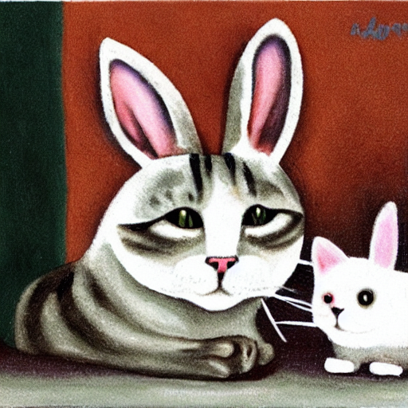
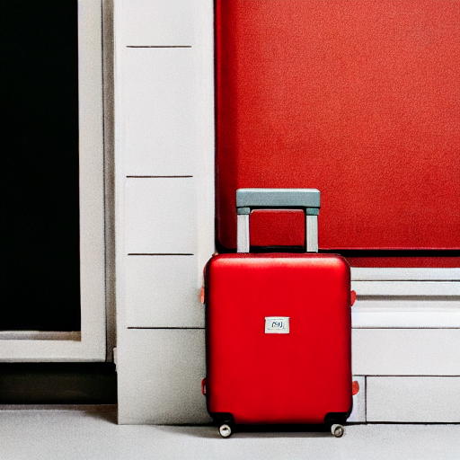
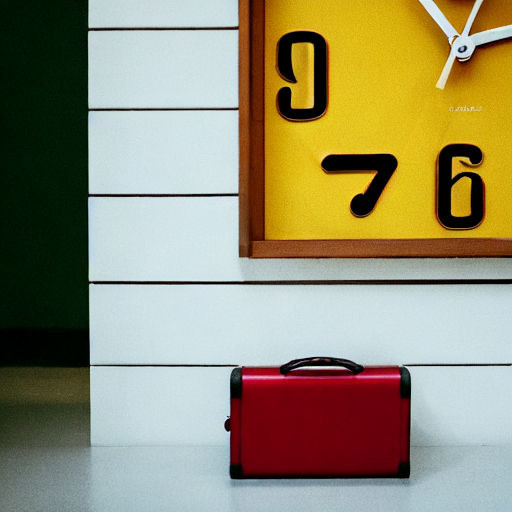

# initNO-implementation-and-Experiments

### PROJECT OVERVIEW

implementation, testing, and benchmarking of the **Initial Noise Optimization (InitNO)** method (arXiv:2404.04650).

---

### CLIP SCORE EVALUATION

The plot below compares average **CLIP Image–Text Similarity** between Baseline SD and InitNO.

Higher means better.

  

**InitNO shows consistently higher CLIP scores across all tested prompts.**

---

### TIME OVERHEAD

InitNO introduces an expected computational cost:

- Approximately **10× slower** than standard Stable Diffusion inference.
- The additional time comes from the gradient-based optimization on the noise.

as described in the original paper.

---

###  QUALITATIVE RESULTS

<table style="width:100%; table-layout: fixed; text-align: center;"> <thead> <tr> <th width="30%">Prompt</th> <th width="35%">Standard SD (Baseline)</th> <th width="35%">InitNO (Optimized)</th> </tr> </thead> <tbody> <tr> <td>A cat and a rabbit</td> <td></td> <td></td> </tr> <tr> <td>A frog and a purple balloon</td> <td></td> <td></td> </tr> <tr> <td>A red suitcase and a yellow clock</td> <td></td> <td></td> </tr> <tr> <td>A cat and a sunflower, Van Gogh style</td> <td></td> <td></td> </tr> </tbody> </table>

---

##  PROJECT FILES

- **generate.py** : Runs InitNO, generates images, and logs inference time.  
- **clip.py**:Computes CLIP similarity scores and plots the comparison chart.  
- **initno/pipeline&utils&run**: Source code for the InitNO method (imported from the official implementation).  

---
